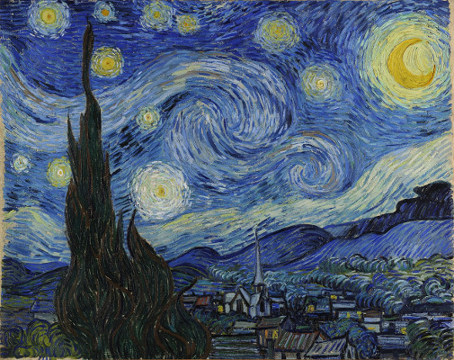
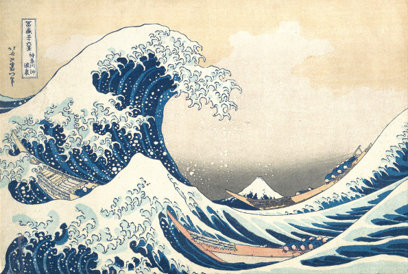
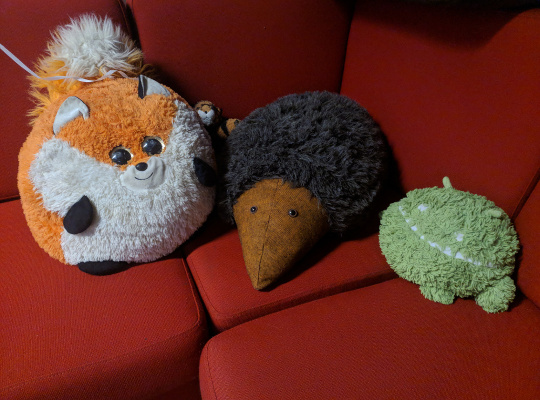
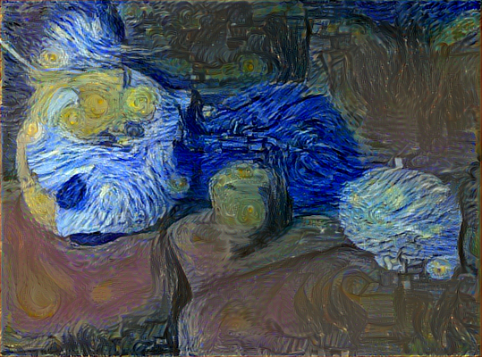
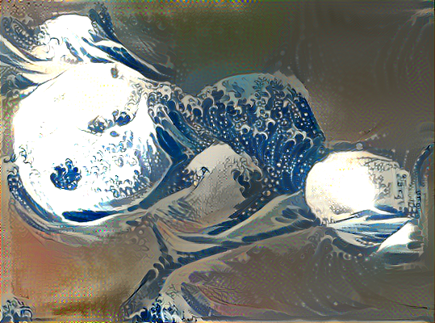
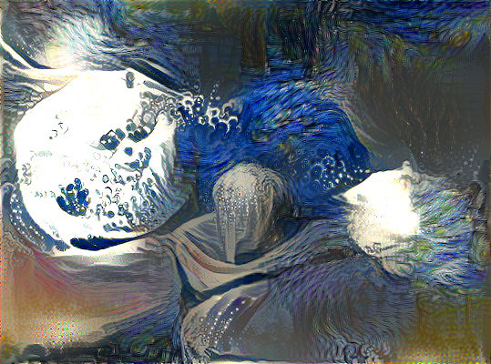
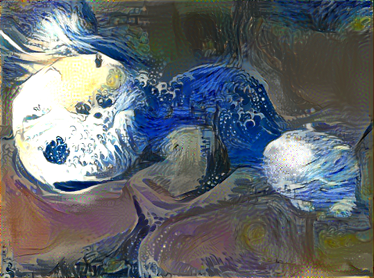
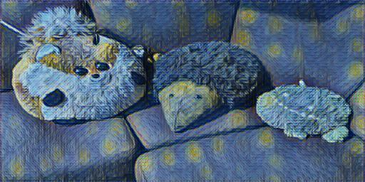
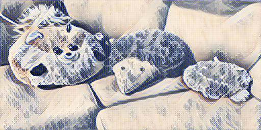

# tf-style-transfer

This repository contains my experiments with image style transfer using neural networks.

To run all the scripts, at least the following are required
- `pip install matplotlib pillow tensorflow-gpu tensorflow-datasets tensorflow-addons opencv-python`
- NVIDIA [CUDA library](https://developer.nvidia.com/cuda-toolkit)
- NVIDIA [cuDNN library](https://developer.nvidia.com/cudnn)

## Style transfer by optimization

Files:
- [transfer_style.py](./transfer_style.py)

We start with the original approach of Gatys et al. ["A Neural Algorithm of Artistic Style", 2015](https://arxiv.org/pdf/1508.06576.pdf).
Conveniently, many implementations of this paper exist.

Using the [Keras example](https://keras.io/examples/neural_style_transfer/) as a starting point, I reworked the code to work with tensorflow 2.0 and use 
the [tf.keras](https://www.tensorflow.org/api_docs/python/tf/keras) API. A [similar example](https://www.tensorflow.org/tutorials/generative/style_transfer) for tensorflow helped with this. This code retains most of the structure of the Keras example, including optimization with scipy's L-BFGS.

To check that the modified script is working, I apply some well-known styles to the student room stuffed animals:

`python transfer_style.py img/animals.jpg img/starry.jpg starry-animals`

`python transfer_style.py img/animals.jpg img/wave.jpg wave-animals`

<table>
<tr>
    <td>
    </td>
    <td>
        
    </td>
    <td>
        
    </td>
</tr>
<tr>
    <td>
        
    </td>
    <td>
        
    </td>
    <td>
        
    </td>
</tr>
</table>

Better results could be achieved by fine-tuning the relative weights of the style layers and the number of iterations, but this does a reasonable job of applying texture, color, and shape from the style reference.

Suppose we want to apply a combination of styles, or our style reference consists of multiple images.
We can extend the original code to transfer multiple styles to the same image. This requires a simple modification of the style loss function to consider multiple style reference images. 

We concatenate the style reference image tensors over a new dimension, compute the gram matrix as if processing a batch of images, then take e.g. the average (mean) or maximum along the new dimension regain the original dimensions. The script is modified to take either a filename or glob pattern for style images.

Testing this on the above styles gives mixed results:

`python transfer_style.py animals.jpg "img/[ws]*[ey].jpg" combined-animals`

<table>
<tr> 
    <th>maximum</th>
    <th>mean</th>
</tr>
<tr>
    <td></td>
    <td></td>
</tr>
</table>

Applying a mix of styles isn't a new idea, [more advanced methods](https://arxiv.org/pdf/1610.07629.pdf) can apply arbitrary combinations of styles in realtime.

## Training a network for style transfer

Files:
- [feedforward.py](./feedforward.py)
- [train_feedforward.py](./train_feedforward.py)
- [transfer_feedforward.py](./transfer_feedforward.py)
- [webcam_demo.py](./webcam_demo.py)

A clear disadvantage of the previous style transfer method is that generating the result is a computationally expensive optimization problem, using gradients wrt. the style loss to iteratively update the input image. Johnson et al. ["Perceptual Losses for Real-Time Style Transfer
and Super-Resolution", 2016](https://cs.stanford.edu/people/jcjohns/eccv16/) use this style loss to instead train a feedforward network to perform the style transfer. I reimplement this setup in tensorflow.

### Feedforward network
The feedforward network implemented in [feedforward.py](./feedforward.py) is based on the description of Johnson et al. (in 
[paper supplementary material](https://web.eecs.umich.edu/~justincj/papers/eccv16/JohnsonECCV16Supplementary.pdf). We include the instance normalization trick of [Ulyanov et al.](https://arxiv.org/abs/1607.08022) for speeding up training and reducing the number of convolution kernels needed. 

### Training
The style transfer network is trained by using the style information from the VGG network as a custom loss function. 
Rather than optimizing the input image to minimize style loss, we instead optimize the weights of the feedforward network 
to produce the desired effect. The network is trained on a diverse set of images from the [MS-COCO](http://cocodataset.org/#home) dataset. These images are preprocessed and shuffled with the tf.data pipeline. As suggested in the paper, training is done with a batch size of 4 for a total of 2 epochs. Checkpoints are saved every 1000 iterations.
(Note: the [training script](./train_feedforward.py) downloads the ~38G dataset on first run)

### Transferring
After training, the feedforward network can be used to apply style transfer to input images in real-time. 
For example, after training on `img/starry.jpg` for 40000 iterations:

`python transfer_feedforward.py img/animals.jpg checkpoints/40000`

<table>
<tr>
    <td>
    </td>
    <td>
        
    </td>
    <td>
        
    </td>
</tr>
<tr>
    <td>
        
    </td>
    <td>
        
    </td>
    <td>
        
    </td>
</tr>
</table>
